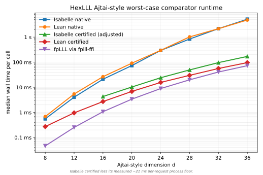
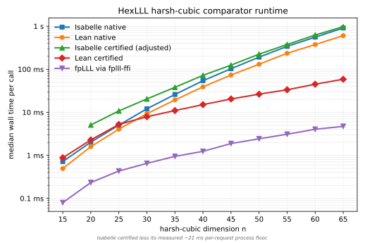

# hex-lll

Part of [`hex`](https://github.com/kim-em/hex-dev), a computer algebra
library for Lean 4. The aim is fast executable code, fully verified, built
with spec-driven development.

`hex-lll` provides executable LLL reduction of an integer lattice basis:
given a basis of a lattice in `ℤᵐ`, it returns a shorter, more orthogonal
basis of the same lattice, with the first row a provably short vector. It
depends on [`hex-gram-schmidt`](https://github.com/leanprover/hex-gram-schmidt)
for the integer Gram-Schmidt data the algorithm carries, and is Mathlib-free.
The correspondence with Mathlib and the full short-vector theory live in
[`hex-lll-mathlib`](https://github.com/leanprover/hex-lll-mathlib).

On adversarial worst-case input — fplll's Ajtai-style `gen_trg` bases, whose
steeply decreasing profile forces a huge swap count — the exact integer
reducers (Lean's `lllNative` and the verified Isabelle extraction) blow up
`~d⁷`, while the **certified path** — an `fpLLL` candidate checked by the
verified Lean `certCheck` — stays cheap, near raw floating-point speed:



That is the design in one picture: get a verified result at close to unverified
speed by *certifying a fast reducer* rather than running an exact one. See
[Performance comparison](#performance-comparison) for what each curve is, the
input families, and how to select the certified versus native path.

# Quickstart

Add to your `lakefile.toml`:

```toml
[[require]]
name = "hex-lll"
git = "https://github.com/leanprover/hex-lll.git"
rev = "main"
```

```lean
import HexLLL

open Hex

-- A small integer lattice basis, one row per basis vector.
def B : Matrix Int 3 3 := Matrix.ofFn fun i j =>
  match i.val, j.val with
  | 0, 0 => 1 | 0, 1 => 1 | 0, 2 => 1
  | 1, 0 => 1 | 1, 1 => 0 | 1, 2 => 2
  | 2, 0 => 3 | 2, 1 => 5 | 2, 2 => 6
  | _, _ => 0

-- The verified entry point. `lll` returns a `(δ, 11/20)`-reduced basis of the
-- same lattice and `lll.firstShortVector` reads off its provably short first
-- row. The three proof arguments are `autoParam`s (`:= by grind`), so a call at
-- a concrete `δ` is just `lll B (3 / 4)`. The short-vector guarantee itself is
-- the theorem `lll_first_row_norm_sq_le` in `hex-lll-mathlib`, which takes the
-- `B.independent` hypothesis separately — a precondition of the theorem, not of
-- the computation.
#check @lll.firstShortVector
#check @lll

-- `lllNative.firstShortVector` / `lllNative.shortVectors` run the exact
-- `lllNative` directly (the body of `lll`'s native path, skipping the provider
-- dispatch). Like `lll`, their proof arguments are filled by `by grind`.
#eval lllNative.firstShortVector B (3 / 4)
#eval lllNative.shortVectors B (3 / 4)

-- The executable integer reducedness oracle.
#eval lllReducedExact (Matrix.identity 3) (3 / 4) (1 / 2)   -- true
```

# Functionality

The public entry point is `lll`, which reduces an integer basis at a
rational factor `δ` and returns a `(δ, 11/20)`-reduced basis of the same
lattice. Behind that one entry point are two reducers, each of which
produces output correct to that same contract, so the result is correct no
matter which one runs. `lll` dispatches through them in order:

- **External provider** (`LLLProvider.dispatch`). If an external reducer is
  installed in the process — via the explicit loader `Hex.lll.loadProvider`
  pointed at a built fpLLL-ffi shared library (see
  [Performance comparison](#performance-comparison)) — `lll` runs it and
  *certifies* the returned candidate with the integer-only checker `certCheck`.
  An absent or rejected candidate falls through. The provider is an independent
  artifact this library neither depends on nor names in its build; it is
  acceleration only, loaded at runtime.
- **Exact integer reducer** (`lllNative`). The trusted all-integer `d`/`ν`
  reducer at the classical size-reduction bound `η = 1/2`. The native path:
  always correct, never approximate.

The surface, by group:

- `lll`, `lll.firstShortVector`, and `lll.shortVectors`: the public reducer,
  its provably short first reduced row, and the ordered reduced rows.
  `firstShortVector` is the short-vector entry point for downstream consumers such as
  [`hex-berlekamp-zassenhaus`](https://github.com/leanprover/hex-berlekamp-zassenhaus).
- `lllNative`: the exact integer reducer at the classical `η = 1/2`, with the
  tighter short-vector constant; call it directly to get the classical
  guarantee.
- `lllNative.firstShortVector` and `lllNative.shortVectors`: proof-free
  variants of the entry points for callers without an independence proof.
- `lllReducedExact`, `lllReducedInterval`, and `lllReducedCheck`: the exact,
  fixed-precision, and dispatched reducedness oracles; `certCheck` is the
  integer certificate checker for an external reducer's output.
- `Matrix.memLattice`, `Matrix.independent`, and `Vector.normSq` for stating
  and checking the inputs and guarantees.

Everything else lives under the `Hex.Internal` namespace and is not part of the
supported API: the integer state `LLLState` and its step/loop machinery, the
fixed-precision interval checker kernel, the external-provider plumbing, and the
dispatch-tuning and diagnostics constants. `open Hex` brings only the surface
above into scope.

# Verification

The library is Mathlib-free, so the deep correctness of LLL lives in the
Mathlib bridge. What is proven here is the short-vector bound reduced to the
size-reduction hypothesis, and the same-lattice half of the external
certificate.

The short-vector bound, `short_vector_bound_of_size_bound`: a reduced,
independent basis has a first row whose squared norm is at most
`(1 / (δ − η²))^(n-1)` times that of any nonzero lattice vector.

```lean
theorem short_vector_bound_of_size_bound (b : Matrix Int n m) {δ η : Rat}
    (hli : Matrix.independent b) (hred : isLLLReduced b δ η)
    (hη : (1 / 2 : Rat) ≤ η) (hδη : η * η < δ) (hδ' : δ ≤ 1) (hn : 1 ≤ n)
    {v : Vector Int m} (hv : Matrix.memLattice b v) (hv' : v ≠ 0) :
    (((b.row ⟨0, Nat.lt_of_lt_of_le Nat.zero_lt_one hn⟩).normSq : Int) : Rat) ≤
      (1 / (δ - η * η)) ^ (n - 1) *
        ((v.normSq : Int) : Rat)
```

The certificate's same-lattice clause, `sameLatticeCert_sound`: when the
integer transforms check out, the input and candidate span the same lattice.

```lean
theorem sameLatticeCert_sound {B B' : Matrix Int n m} {U V : Matrix Int n n} :
    sameLatticeCert B B' U V = true →
      ∀ v, B.memLattice v ↔ B'.memLattice v
```

**The size-reduction bound `η` and its constants.** The public `lll`
certifies its output `(δ, 11/20)`-reduced: every Gram-Schmidt coefficient
satisfies `|μ| ≤ 11/20`. Two numbers in `lll`'s signature follow from that
`η = 11/20`. The precondition is `121/400 < δ`, because `121/400 = (11/20)² =
η²` and the bound is well-defined only when `η² < δ`; and the short-vector
constant is `1/(δ − 121/400)`. So the `121/400` in `lll`'s signature is just
`η²` — it stands exactly where the classical bound would put `1/4 = (1/2)²`.

Why `11/20` and not the classical `1/2`? Solely because of the external
provider. The exact `lllNative` already lands at `|μ| ≤ 1/2`, so on its own it
gives the tighter `1/4 < δ` contract. But a black-box external reducer cannot
be forced to land exactly `|μ| ≤ 1/2` (fplll's default size-reduction target
sits slightly above `1/2`), so the certified-dispatch path accepts its
candidate at the looser `11/20`. That is the only reason the public contract is
stated at `11/20` (so `η² = 121/400`) rather than `1/2` (so `η² = 1/4`). The
exact `lllNative` keeps the classical `η = 1/2`, with the strictly better
short-vector theorem `lllNative_short_vector` (precondition `1/4 < δ`, constant
`1/(δ − 1/4)`): **call `lllNative` directly when you want that tighter
guarantee**, rather than the public `lll`.

Is the looser bound a concern? It is an honest weakening of the formal
constant, and the weakening compounds with dimension, so it is worth being
precise about. At `δ = 3/4` the squared-norm constant goes from
`1/(δ − 1/4) = 2` for `lllNative` to `1/(δ − 121/400) ≈ 2.235` for `lll`, so
the per-vector length factor is about `5.7%` larger per dimension: modest in
low dimension, real in high. Tightening `η` back toward `1/2` would require a
stricter certified checker (higher working precision, tighter requested
margins, or enforcing exact `|μ| ≤ 1/2`), trading run time and a higher
fallback rate for a better constant. The dispatch's requested-parameter and
precision constants are internal tuning, documented at their definitions; none
of them affects soundness.

The end-to-end guarantees of `lll` are proved in
[`hex-lll-mathlib`](https://github.com/leanprover/hex-lll-mathlib): that its output
is `(δ, 11/20)`-reduced, spans the same lattice, and satisfies the
short-vector bound, together with the certificate soundness theorem
`certCheck_sound`.

# Performance comparison

HexLLL is benchmarked against the verified Isabelle `LLL_Basis_Reduction`
extraction and the unverified floating-point `fpLLL`, across input families
chosen to stress different parts of the algorithm. Here is a second family,
`harsh-cubic`, where the entry bit-length grows with the dimension:



**The five curves.** Each plot is log-scale wall-time per reduction against the
family's dimension:

- **fpLLL** — the raw floating-point reducer, unverified. The speed baseline.
- **Lean native** — `lllNative`, HexLLL's exact all-integer `d`/`ν` reducer.
  Correct by construction, but its exact arithmetic pays for wide operands and
  high swap counts.
- **Lean certified** — an `fpLLL` candidate *checked* by the verified Lean
  `certCheck`. Inherits floating-point speed and adds only a cheap integer
  check, so it hugs the fpLLL curve while remaining fully verified.
- **verified Isabelle native** — the Isabelle `LLL_Basis_Reduction` extraction's
  own reducer; the independent verified point of comparison.
- **verified Isabelle certified** — the *same* fpLLL candidate checked by the
  Isabelle verified checker instead of the Lean one; the apples-to-apples
  yardstick for the Lean certified path.

**The input families.** Each stresses a different cost:

- **`random-bounded`** — near-orthogonal random bases; the easy baseline (few
  swaps).
- **`harsh-cubic`** — entries `~2^{3.3n}`; stresses exact-integer operand-width
  growth (above).
- **`ajtai`** — fplll `gen_trg` worst-case triangular bases; stresses the swap
  / iteration count (`Θ(d² log B)`) — the plot at the top of this README.
- **`q-ary`** — LWE/SIS `[[I,H],[0,qI]]` bases; the cryptographic Z-shape.
- **`ntru`** — `[[I,Rot h],[0,qI]]` bases; a planted dense sublattice plus a
  q-block.
- **`knapsack`** — the rectangular `d×(d+1)` integer-relation form; the only
  `cols ≠ rows` family.

Across every family the exact reducers are correct but climb steeply on the hard
bases, while Lean certified stays within ~1.2–2.5× of raw fpLLL — verified
output at close to floating-point cost.

**Selecting the certified vs native path — a runtime choice, not an import.**
`HexLLL` always builds its FFI shim, and the *same* `lll` call picks its path by
whether an external provider is installed in the process:

- call **`Hex.lll.loadProvider path`** with the path to a built fpLLL-ffi shared
  library (`scripts/oracle/setup_fplll_ffi.sh` builds one and prints its path);
  it returns `true` on success, after which `lll` takes the **certified path**
  (the candidate is certified by `certCheck`). `Hex.lll.providerActive : IO Bool`
  reports whether a provider is currently installed;
- load nothing (or if certification ever failed) and `lll` runs the exact
  **`lllNative`** directly.

Loading is an explicit, discoverable Lean action next to `lll` itself — there is
no environment variable read on the `lll` path and no implicit `dlopen`. Either
way the result satisfies the same `(δ, 11/20)`-reduced contract. To force
the exact path unconditionally — and get the tighter `η = 1/2` guarantee
(precondition `1/4 < δ`, constant `1/(δ − 1/4)`; see [Verification](#verification))
— call `lllNative` directly.

Full methodology, all six per-family plots, and the asymptotic fits are in the
reference manual's
[performance chapter](https://kim-em.github.io/hex-dev/find/?domain=Verso.Genre.Manual.section&name=hex-lll-performance)
and in [PERFORMANCE.md](PERFORMANCE.md).

# Trust boundary

The kernel proofs trust none of the acceleration machinery. The capstone
theorems reduce to the ordinary Lean axioms `propext`, `Classical.choice`, and
`Quot.sound` (and Mathlib, for the `hex-lll-mathlib` results); there is no
`sorry`, no `axiom`, and no `native_decide` anywhere in the libraries. Concretely:

- **External provider.** The optional reducer is reached through an
  `@[extern] opaque` hook. Its output is never trusted: it is certified by the
  integer-arithmetic checker `certCheck` before use, and an absent or rejected
  candidate falls back to the native reducer. A wrong or adversarial provider
  cannot produce a wrong result, only a fallback.
- **Diagnostics.** The provider and checker tallies record decision
  counts via `@[implemented_by]` side effects in compiled code only. They are
  definitionally identity in the logic; no theorem depends on them.
- **Execution vs. checking.** Compiled execution may call the C FFI shim
  (`dlopen`); kernel proof checking calls none of it.

The requested-parameter, precision, and dispatch-calibration constants are
performance tuning only and are outside the trusted story; none affects soundness.

# Reference manual

The hex reference manual covers this library at
<https://kim-em.github.io/hex-dev/find/?domain=Verso.Genre.Manual.section&name=hex-lll>.

# Contributing

Development happens in the [`hex-dev`](https://github.com/kim-em/hex-dev)
monorepo, not in this published mirror. Contributions are welcome as pull
requests to the `SPEC/` directory: describe the behaviour you want, and
leave the implementation to the maintainer.
